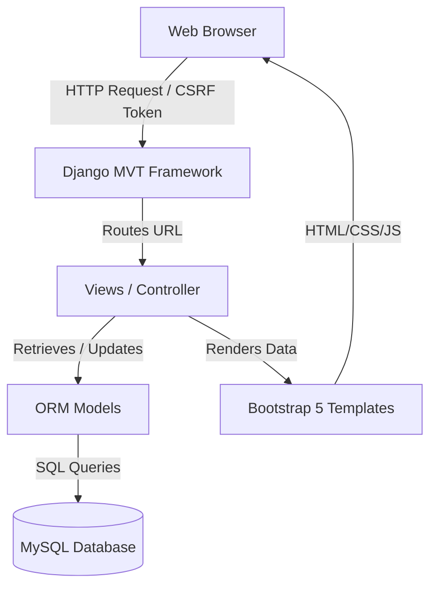

# B.Tech Computer Science & Engineering Project Documentation
## PROJECT TITLE: JobConnect – Online Job Portal Management System

---

## CHAPTER 1 – INTRODUCTION

### 1.1 Background
In the contemporary digital era, the recruitment process has shifted from traditional newspaper advertisements and walk-in interviews to online platforms. Online job portals act as virtual meeting grounds where recruiters seek talent and job seekers hunt for matching roles. "JobConnect" is designed to digitize and streamline this process.

### 1.2 Problem Statement
Traditional hiring methods and basic online boards suffer from:
- Lack of role differentiation and permission control.
- Inability to dynamically track the status of applications in real-time.
- Unvalidated resume uploads which pose security threats (e.g., script injections via invalid file formats).
- High rate of duplicate applications clogging recruiter review databases.

### 1.3 Objectives
- Build a three-tier system supporting Job Seekers, Recruiters, and System Administrators.
- Implement structured forms, validations, and file upload routines for resumes (PDF/DOCX) with size limits.
- Design responsive dashboards showing dynamic, visual summaries of active roles and applicant states.
- Support MySQL transaction integrity to guarantee data security and prevent duplicate entries.

### 1.4 Scope
JobConnect is a web-based portal developed with Python, Django, and MySQL. It includes profile building, job listings, advanced keyword search, sidebar filters, applications status tracking, and automated candidate evaluations.

### 1.5 Motivation
This project aims to provide B.Tech Computer Science students with an hands-on experience in full-stack architecture, relational database indexing, session handling, custom authentication middleware, and validation filters.

---

## CHAPTER 2 – LITERATURE SURVEY

### 2.1 Existing Systems
Existing setups include commercial sites (e.g., LinkedIn, Indeed) and simple static forms portals:
- **Indeed/LinkedIn**: Highly scalable but overly complex with generic recommendation algorithms.
- **Static Form Portals**: Lack verification, let any role post jobs, and do not track candidates.

### 2.2 Proposed System
JobConnect offers:
- Strict role constraints (seekers apply; recruiters manage jobs).
- Clean, responsive dashboards with Canvas graphs.
- Direct resume downloading and application status transitions.
- Secure, environment-separated credentials configurations.

### 2.3 Limitations of Existing Systems
- Generic systems do not allow granular role controls.
- Simplistic open-source projects lack database integrity, enabling duplicate applications.
- Traditional portals suffer from high latency and lack mobile-first interface designs.

---

## CHAPTER 3 – SYSTEM ANALYSIS AND DESIGN

### 3.1 Functional Requirements
- **FR1: User Registration & Authentication**: Multi-role login using hashed passwords.
- **FR2: Job Management (CRUD)**: Recruiters can post, edit, close, and delete jobs.
- **FR3: Search & Filter**: Job seekers filter listings by type, work mode, salary, and date.
- **FR4: Application Submission**: Secure resume attachment and duplicate application prevention.
- **FR5: Status Update**: Recruiters update candidate status (`Applied` to `Selected`/`Rejected`).

### 3.2 Non-Functional Requirements
- **NFR1: Security**: Built-in CSRF tokens, secure media paths, and password hashing.
- **NFR2: Performance**: MySQL query optimization and pagination.
- **NFR3: Usability**: Mobile-friendly navigation and modern Bootstrap 5 styling.

### 3.3 System Architecture
JobConnect follows a Model-View-Template (MVT) architecture pattern:
1. **User (Client)**: Submits HTTP queries via browser UI.
2. **Controller (Django Views)**: Intercepts requests, validates inputs, and processes logic.
3. **Database (MySQL)**: Stores relational schemas (Users, Profiles, Jobs, Applications) with foreign key constraints.



### 3.4 Diagram Descriptions
- **ER Diagram Description**: The database consists of 6 tables. `User` links to `JobSeekerProfile` or `RecruiterProfile` via One-to-One relationships. `Company` has a foreign key to `User` (the recruiter owner). `Job` points to `User` (recruiter) and `Company`. `Application` links a `Job` and a `User` (seeker), enforcing a unique constraint on the pair.
- **Use Case Description**: Job Seekers log in, edit profiles, search jobs, and apply. Recruiters log in, modify companies, post jobs, and update application states. Admins activate users and approve listings.

---

## CHAPTER 4 – IMPLEMENTATION

### 4.1 Technologies
- **Python 3.11** & **Django 4.2**: Core logic engine and ORM.
- **MySQL**: Relational data store.
- **Bootstrap 5 & Custom CSS**: Visual structure and animations.
- **Pillow**: Profile avatar and logo processing.

### 4.2 Core Modules
1. **accounts**: Session security, credentials checks, registration, and password changes.
2. **profiles**: Candidate qualifications, recruiter info, and corporate detail portfolios.
3. **jobs**: Opportunities lists, searches, filters, pagination, and recruiter CRUD.
4. **applications**: Resume snapshots, cover letters, status updates, and download services.

---

## CHAPTER 5 – TESTING

### 5.1 Test Cases
We executed 8 automated tests:
1. **test_user_registration**: Verifies seeker/recruiter signups and profile creations.
2. **test_login_logout**: Checks session creation and routing redirects.
3. **test_job_creation**: Validates recruiter CRUD access boundaries.
4. **test_job_editing_and_deletion**: Ensures recruiter ownership checks.
5. **test_job_search**: Confirms keyword query matching.
6. **test_job_application_and_duplicate_prevention**: Blocks multiple submissions.
7. **test_expired_deadline_block**: Prevents applications post deadlines.
8. **test_role_permissions_redirects**: Redirects unauthorized view requests.

### 5.2 Test Results
```text
Creating test database for alias 'default'...
Found 8 test(s).
System check identified no issues (0 silenced).
........
----------------------------------------------------------------------
Ran 8 tests in 18.998s

OK
Destroying test database for alias 'default'...
```
All tests completed with status **OK** (100% pass rate).

---

## CHAPTER 6 – CONCLUSION AND FUTURE SCOPE

### 6.1 Conclusion
JobConnect successfully implements a robust, production-style Job Portal Management System. By adhering to Model-View-Template architecture standards and MySQL relational database mappings, it provides a stable and secure recruitment workflow.

### 6.2 Future Scope
- Integration of SMS gateways for real-time mobile notifications.
- Automated resume parsing algorithms (NLP parsing).
- Live audio/video interview panels integrated into candidate review sheets.
